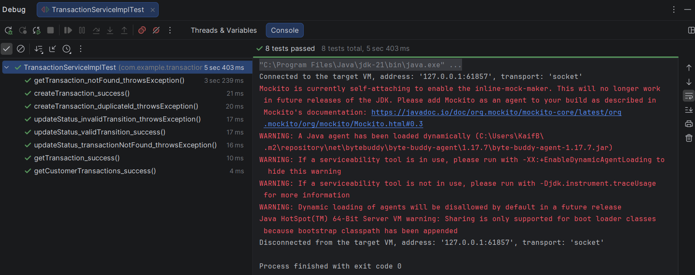

## Test Run Output


The test suite completed successfully with 9 tests executed.

```text
[INFO] Tests run: 8, Failures: 0, Errors: 0, Skipped: 0
[INFO] Tests run: 1, Failures: 0, Errors: 0, Skipped: 0

[INFO] Results:
[INFO]
[INFO] Tests run: 9, Failures: 0, Errors: 0, Skipped: 0
[INFO]
[INFO] ------------------------------------------------------------------------
[INFO] BUILD SUCCESS
[INFO] ------------------------------------------------------------------------
[INFO] Total time:  20.151 s
[INFO] Finished at: 2026-09-02T17:24:19+05:30
[INFO] ------------------------------------------------------------------------
```
